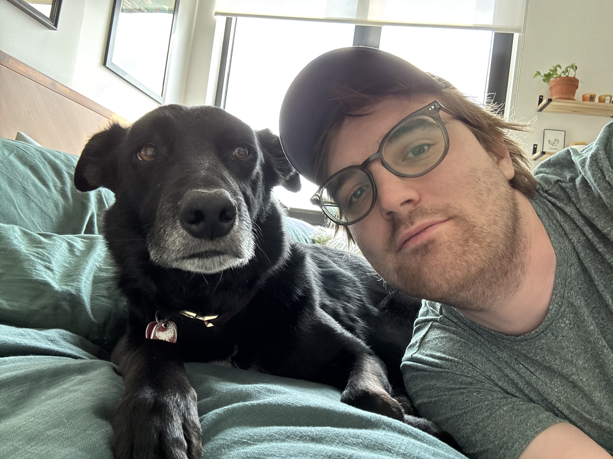

# About ModSmith

ModSmith is primarily developed by Charlie Imhoff, from Brooklyn NY. The project is open to collaboration from anyone with passion.

If you appreciate using ModSmith, feel free to support by starring the [Github repo](https://github.com/cpimhoff/Sts2-ModSmith), opening a PR to improve it, filing feedback, or posting an issue that's actually just a compliment.

---

Here's a picture of me and my dog, Rolo. If you include a Rolo reference in your mod as flavor text or anything like that, I'll be forever grateful.

<!-- {.charlie-and-rolo} -->
